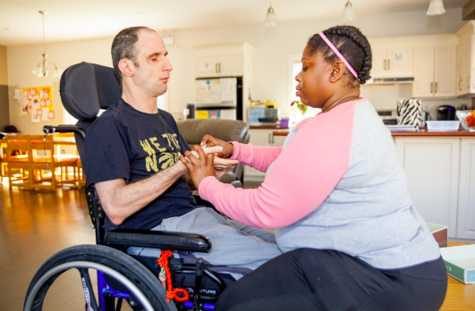
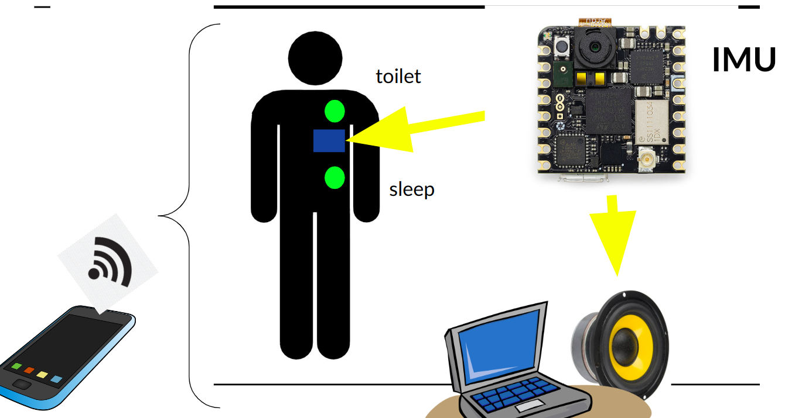
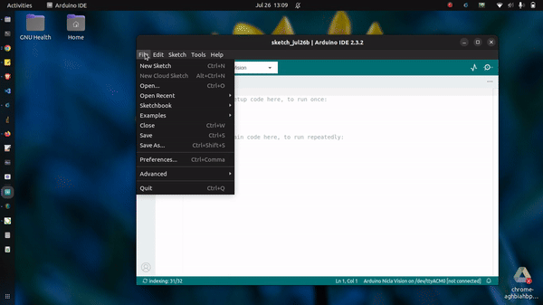
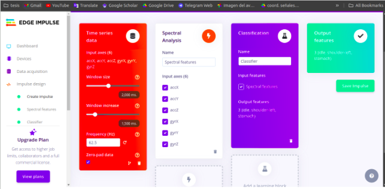
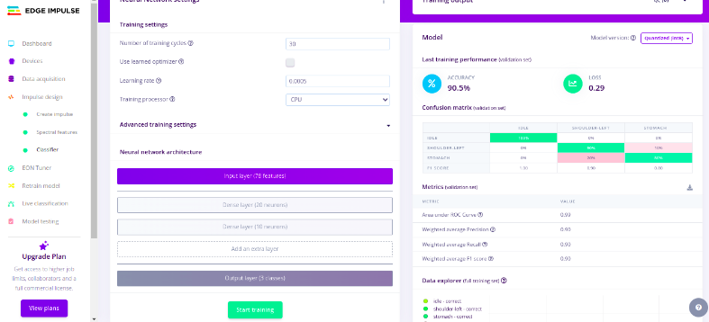

# final_project_WorkshopTinyML

## Problem Statement

In the realm of sustainable development, a critical issue is the communication barriers faced by deafblind individuals. These individuals encounter significant challenges in interacting with their surroundings, which restricts their ability to fully participate in society. Traditional communication methods, such as tactile sign language, tactile fingerspelling, and various technological communication aids, while beneficial, are not always accessible or adaptable to the unique needs of every individual. This creates a pressing need for more comprehensive and accessible communication solutions tailored to the specific requirements of deafblind persons.

Deafblind individuals often rely on a range of communication methods including Irish Sign Language (ISL), Lámh, hand-under-hand/tactile sign language, tactile fingerspelling, Picture Exchange Communication Systems (PECs), objects of reference, concrete symbols, swell symbols, braille, haptic signs, Tadoma, and technological communication aids. However, these methods can be limited by the availability of resources, the need for specialized training, and the personal preferences and abilities of each individual. Consequently, the lack of universally accessible communication tools exacerbates the social isolation and dependence experienced by the deafblind community, underscoring the necessity for innovative solutions.

## Proposed Solution

To address this issue, a project leveraging TinyML (Tiny Machine Learning) and Edge Impulse for data processing has been developed. This project involves acquiring relevant data and uploading it to Edge Impulse, followed by the development of a Python-based code utilizing MQTT (paho-mqtt) for message queuing and GTTS (Google Text-to-Speech) for converting text to speech. This approach aims to create more accessible and customizable communication devices for deafblind individuals, enhancing their ability to interact effectively with their environment.

The project can be replicated through the following steps:
1. **Data Acquisition and Upload to Edge Impulse**:
    - Clone the project from the Edge Impulse public repository. https://studio.edgeimpulse.com/public/494730/live  [Link](https://studio.edgeimpulse.com/public/494730/live)
    - Ensure the Wi-Fi firmware is fixed in Arduino for seamless data upload.
  
    

2. **Development of Python Code**:
    - Implement MQTT using the `paho-mqtt` library to handle message queuing and delivery.
    - Utilize GTTS (`gtts`) for text-to-speech conversion to enable audible feedback.

By following these steps and utilizing the provided resources, developers can create innovative communication aids that significantly improve the quality of life for deafblind individuals. This solution not only addresses the immediate communication needs but also paves the way for further advancements in assistive technologies, promoting greater inclusion and independence within the deafblind community.

# Would you like to try?
upload this code to arduino arduino_code.ino (It needs arduino_secrets.h, it is in folder), then run python_code.py (firstly install all libraries may needs )
You can use this line code in your terminal:  
    - $ mosquitto_sub -t "tinyml-brasil/data" -h "test.mosquitto.org"
    
